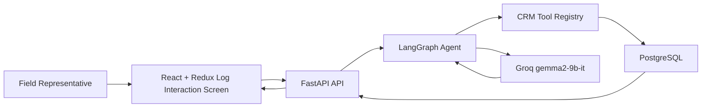

# Architecture

## Product Goal

The product is an AI-first CRM interaction workspace for life-sciences field representatives. It supports structured logging and conversational logging while keeping the representative inside one HCP context.

## High-Level Flow

## Backend

- `app/main.py` exposes FastAPI endpoints.
- `app/ai.py` defines the LangGraph agent, router, tool registry, LLM calls, and deterministic fallback behavior.
- `app/models.py` stores HCP profiles and interaction intelligence.
- `app/seed.py` creates realistic demo HCP records.

## LangGraph Tools

- `log_interaction` captures structured or chat-based interaction data and enriches it with summary, topics, products, objections, commitments, compliance flags, quality score, and next best action.
- `edit_interaction` modifies a logged interaction.
- `get_hcp_profile` retrieves HCP profile and recent history.
- `suggest_next_best_action` recommends the next field action.
- `draft_follow_up` drafts a compliant follow-up email.
- `compliance_review` checks the latest interaction for off-label, adverse-event, sample, and patient-identifiable information signals.

## Frontend

- `App.jsx` composes the HCP workspace.
- `crmSlice.js` manages HCPs, interactions, insights, chat messages, and tool runs through Redux Toolkit.
- `InteractionForm.jsx` supports structured data capture.
- `AgentChat.jsx` supports natural-language capture.
- `ToolConsole.jsx` demonstrates the LangGraph tools.
- `InsightsStrip.jsx` gives field-ready quality, compliance, and topic metrics.

## Industry-Level Considerations

- The app keeps compliant fallback behavior when a Groq key is not configured.
- The LLM is instructed not to invent claims or make off-label statements.
- Interactions store auditable raw notes and AI-derived fields separately.
- Compliance flags are visible in the timeline and available through a dedicated tool.
- The API is documented automatically at `/docs`.

